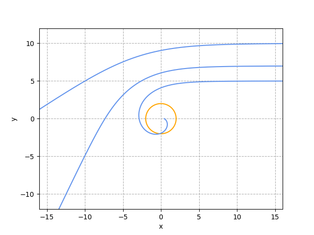

<!-- 
**

**
**
周子杰
**

**
化学化工学院 化学强基2301 
** -->

**摘要:** 爱因斯坦方程是广义相对论的基本方程。在广义相对论框架下，求解爱因斯坦方程后可以得到时空的度规张量，而度规张量决定了引力场下的物体该如何运动，因此爱因斯坦方程在广义相对论中有着重要的作用。静态球对称时空是最容易求解的一种情况，该情况下的真空爱因斯坦方程的解被称为施瓦西解。施瓦西解可以解决许多牛顿力学无法完全解决的问题，如水星近日点的进动、光线弯折等物理问题。本文会给出施瓦西解的一个简单推导，并会简单讨论施瓦西解的一些性质与应用。

**关键词:** 静态球对称时空；真空爱因斯坦方程；施瓦西解；嵌入图；施瓦西黑洞；光线弯折.

## 1.引言

&emsp;&emsp;广义相对论是描述宇宙四大基本相互作用之一——引力的一门学科。与狭义相对论不同，广义相对论框架下的背景时空并不平直，时空曲率不可忽略。广义相对论认为，引力的本质是时空的弯曲，在弯曲时空下，自由运动的物体不再做匀速直线运动，而是会沿着时空的测地线（令时空空中两点之间的线长取极值的轨迹）运动。在广义相对论框架下，时空的弯曲可以用度规张量来表示。不考虑宇宙学常数项，度规张量的运动方程可以表示为（为简化公式，本文采用抽象指标记号、几何单位制和爱因斯坦求和约定）

$$
\begin{equation}
R_{ab}-\frac{1}{2}g_{ab}R=8\pi T_{ab}
\end{equation}
$$

这就是爱因斯坦方程。其中$R_{ab}$是里奇张量，是以度规张量为自变量的函数；$g_{ab}$是度规张量，代表时空的弯曲；$R=g^{ab}R_{ab}$定义为标量曲率；$T_{ab}$为能动张量，代表时空中物质的分布情况。这是一个复杂的二阶非线性偏微分方程，通过求解该方程，我们可以得到给定物质分布的时空的度规信息，从而确定物体在该时空下的运动状况。

&emsp;&emsp;在一般情况下，方程（1）是十分难以求得解析解的，但是对于一些简单情况，我们可以求得方程（1）的解析解，本文要处理的真空球对称引力场就是为数不多的一类可以直接求得解析解的情况，这种情况下的爱英斯坦方程的解被称为施瓦西解。施瓦西解的应用非常广泛，比如可以用作微扰理论和格林函数的零阶近似，可以用来近似描述恒星周围的引力场等。本文的第二节将会给出真空球对称引力场的爱因斯坦方程的一个简单求解过程，并在第三节会对该解析解进行一些简单的讨论。

## 2.爱因斯坦方程的求解

&emsp;&emsp;由于爱因斯坦方程是一个复杂的二阶非线性偏微分方程，即使是真空球对称引力场这样的简单情况，爱因斯坦方程的求解都是非常困难且繁琐的。由于篇幅限制，本文在推导的过程中会省略一些步骤，读者对这些步骤感兴趣的话可以去阅读相关读物 [^1]。

### 2.1 前置知识

**1. 测地线方程**

&emsp;&emsp;给定度规张量$g_{ab}$，在该坐标系下的测地线方程可以写为

$$
\begin{equation}
\frac{d^2x^\sigma}{dt^2}+\Gamma^{\sigma}_{\mu\nu}\frac{dx^\mu}{dt}\frac{dx^\nu}{dt}=0
\end{equation}
$$

其中$x^\mu$是坐标的第$\mu$分量，$\Gamma_{\mu\nu}^{\sigma}$被称为克里斯托弗联络（简称克氏符）的分量形式，可以用度规张量表示为

$$
\begin{equation}\Gamma^{\sigma}_{\mu\nu}=\frac{1}{2}g^{\sigma\rho}(g_{\rho\mu,\nu}+g_{\nu\rho,\mu}-g_{\mu\nu,\rho})\end{equation}
$$

其中$g_{\mu\nu,\rho}=\frac{\partial g_{\mu\nu}}{\partial x^{\rho}}$代表度规张量的分量对坐标的导数。通过求解该测地线方程，可以解得给定度规张量的时空的测地线族，进而可以确定该度规下自由质点的运动轨迹。

**2. 真空爱因斯坦方程**

&emsp;&emsp;在真空条件下，物质的能动张量为零，方程（1）可简化为
$$
\begin{equation}R_{ab}-\frac{1}{2}g_{ab}R=0\end{equation}
$$

对方程（4）两边同时乘上$g^{ab}$，并对ab指标进行缩并，根据度规张量缩并的性质$g^{ab}g_{ab}=1$可得

$$
\begin{equation}g^{ab}R_{ab}-\frac{1}{2}g^{ab}g_{ab}R=\frac{1}{2}R=0\end{equation}
$$

得到真空条件下的标量曲率等于零，最后可以写出真空爱因斯坦方程为

$$
\begin{equation}R_{ab}=0\end{equation}
$$

所以在真空条件下，里奇张量恒为零。里奇张量是度规的函数，被定义为黎曼曲率张量的对第二、第四指标的缩并，其坐标分量可以用克氏符表示为

$$
\begin{equation}
R_{\mu\sigma}=R_{\mu\nu\sigma}^{\nu}=\Gamma^\nu_{\mu\sigma,\nu}-\Gamma^{nu}_{\nu\sigma,\mu}+\Gamma^{\lambda}_{\mu\sigma}\Gamma^{nu}_{\lambda\nu}-\Gamma^{\lambda}_{\nu\sigma}\Gamma^{nu}_{\lambda\mu}
\end{equation}
$$

而根据方程（3）克氏符也是与度规张量有关，所以方程（6）是对于度规张量的偏微分方程。

**3. 静态球对称度规**

&emsp;&emsp;设该时空下的线元为$ds^2$，可以得到线元在给定坐标系下的表达式

$$
\begin{equation}ds^2=g_{\mu\nu}dx^{\mu}dx^{\nu}\end{equation}
$$

在这里我们采用球坐标系，使用$t,r,\theta,\phi$作为坐标，即令$x^0=t,x^1=r,x^2=\theta,x^3=\phi$。

&emsp;&emsp;由于我们讨论的背景时空是静态的，所以度规不随时间的变化而变化，故度规张量各分量都不含时。又因为线元具有时间反演不变性，故$g_{0\mu}dtdx^{\mu}=-g_{0\mu}dtdx^\mu$，所以$g_{0\mu}=0$，故度规的时间坐标和空间坐标的交叉项为0。

&emsp;&emsp;由于我们讨论的背景时空是球对称的，所以在等 $t$ 等 $r$ 的情况下，度规就是以球面度规，即

$$
\begin{equation}d\hat{s}^2=r^2(d\theta^2+\sin^2\theta d\phi^2)\end{equation}
$$

综上所述，我们可以得到静态球对称时空下线元的一般表达式

$$
\begin{equation}
\begin{aligned}
ds^2&=g_{00}dt^2+g_{11}dr^2+d\hat{s}^2
\\\ &=g_{00}dt^2+g_{11}dr^2+r^2(d\theta^2+\sin^2\theta d\phi^2)
\end{aligned}
\end{equation}
$$

其中$g_{00}$和$g_{11}$是未知函数，可以通过爱因斯坦方程（1）确定。考虑到时空的球对称性，可以认为$g_{00}$和$g_{11}$不含角度变量。为了便于下一步的求解，可以令$g_{00}=-e^{2A(r)},g_{11}=e^{2B(r)}$，即

$$
\begin{equation}ds^2=-e^{2A(r)}dt^2+e^{2B(r)}dr^2+r^2(d\theta^2+\sin^2\theta d\phi^2)\end{equation}
$$

**4. 线元（11）所对应的克氏符与里奇张量**

&emsp;&emsp;在之后的推导中，我们需要用到线元（11）所对应的克氏符与里奇张量，其计算可以直接将度规代入克氏符和里奇张量的计算式（3）（7）来进行计算。此处使用了Mathematica辅助公式推导，现将计算所得非零克氏符列举如下

$$
\begin{equation}
\begin{aligned}
&\Gamma^{0}_{01}=\Gamma^{0}_{10}=A'\\
&\Gamma^{1}_{00}=A'e^{2(A-B)}\\
&\Gamma^{1}_{11}=B'\\
&\Gamma^{1}_{22}=-re^{-2B}\\
&\Gamma^{1}_{33}=-r\sin^2 \theta e^{-2B}\\
&\Gamma^{2}_{12}=\Gamma^{2}_{21}=\Gamma^{3}_{13}=\Gamma^{3}_{31}=\frac{1}{r}\\
&\Gamma^{2}_{33}=-\sin\theta \cos \theta \\
&\Gamma^{3}_{23}=\Gamma^{3}_{32}=\cot\theta
\end{aligned}
\end{equation}
$$

将（12）代入（7）中，计算得到的非零里奇张量有
$$
\begin{equation}
\begin{aligned}
&R_{00}=-e^{2(A-B)}(-A''+A'B'-A'^2-2r^{-1}A')\\
&R_{11}=A''+  A'^2-A'B'-\frac{2 B'}{r}\\
&R_{22}=e^{-2 B } \left(r\left(A'-B'\right)+1\right)-1\\
&R_{33}=   \left(-e^{-2 B}(r \left(B'-A'\right)-1)+1\right)\sin ^2\theta\\
\end{aligned}
\end{equation}
$$

### 2.2 施瓦西解的导出

&emsp;&emsp;在有了上面那些前置知识后，我们可以正式开始求解静态球对称时空下的真空爱因斯坦方程(6)了。写出方程（6）的坐标分量形式，即

$$
\begin{equation}
R_{\mu\nu}=0
\end{equation}
$$

将（13）代入方程（14），可得

$$
\begin{equation}
-A''+A'B'-A'^2-\frac{2A'}{r}=0
\end{equation}
$$

$$
\begin{equation}
A''+  A'^2-A'B'-\frac{2 B'}{r}=0
\end{equation}
$$

$$
\begin{equation}
e^{-2 B } \left(r\left(A'-B'\right)+1\right)-1=0
\end{equation}
$$

(14)加（15）可得

$$
\begin{equation}
A'+B'=0
\end{equation}
$$

故

$$
\begin{equation}
A=-B+C
\end{equation}
$$

其中$C$为任意常数。将（19）代入方程（17），化简可得

$$
\begin{equation}
1-2rB'=e^{2B}
\end{equation}
$$

将（20）移项，两边同时积分，可得

$$
\begin{equation}
e^{2B}=(1+\frac{D}{r})^{-1}
\end{equation}
$$

将（21）代入（19）可得

$$
\begin{equation}
e^{2A}=(1+\frac{D}{r})e^{2C}
\end{equation}
$$

由于广义相对性原理，进行坐标变换并不会改变物理规律，故总可选取新的时间坐标，使得$t=e^{2C}t$，将（21）（22）代入（11），得

$$
\begin{equation}ds^2=-(1+\frac{D}{r})dt^2+(1+\frac{D}{r})^{-1}dr^2+r^2(d\theta^2+\sin^2\theta d\phi^2)\end{equation}
$$

由于牛顿引力论是广义相对论的弱场近似，所以当引力场很弱（$r$很大）的时候，广义相对论表述就会退化成牛顿引力论就表述。根据广义相对论的线性近似[^2]，可以确定常数$D=-2M$，其中 $M$ 为引力源质量。综上所述，静态球对称时空下的真空爱因斯坦方程的解为

$$
\begin{equation}ds^2=-(1-\frac{2M}{r})dt^2+(1-\frac{2M}{r})^{-1}dr^2+r^2(d\theta^2+\sin^2\theta d\phi^2)\end{equation}
$$

这就是施瓦西解，其所对应的度规也被称为施瓦西度规。可以看出，当 $r=2M$ 时，度规发散，所以该点是施瓦西时空的一个奇点，对应的 $R=2M$ 通常被称为施瓦西半径。在第三节的讨论中，我们将会说明，施瓦西半径就是事件视界的边界（也就是施瓦西黑洞的边界）。

## 3.对施瓦西解的简单讨论

&emsp;&emsp;在第二节中，我们简单求解了静态球对称时空下的真空爱因斯坦方程，并得到了施瓦西度规。这一节中，我们将对施瓦西度规的性质与其应用进行一些简单的讨论。

### 3.1 光线在引力场下的弯折

&emsp;&emsp;光线弯折是广义相对论的一个经典的实验验证。这里使用施瓦西度规来讨论这一现象。

&emsp;&emsp;本文并不打算直接求解测地线方程（2）来得到施瓦西时空的类光测地线，因为这并不好解。这里可以使用一些守恒量来大大减少求解难度。根据类光矢量的定义 $g_{\mu\nu}U^\mu U^\nu=0$ 可得[^3]

$$
\begin{equation}-(1-\frac{2M}{r})(\frac{dt}{d\tau})^2+(1-\frac{2M}{r})^{-1}(\frac{dr}{d\tau})^2+r^2\frac{d\theta}{d\tau}+r^2\sin^2\theta(\frac{d\phi}{d\tau})^2=0\end{equation}
$$

由于时空的球对称性，我们总可以通过空间旋转的方法使得所研究的曲线始终在球体的赤道面内，即 $\theta=\frac{\pi}{2}$ ，所以（27）可以变为

$$
\begin{equation}-(1-\frac{2M}{r})(\frac{dt}{d\tau})^2+(1-\frac{2M}{r})^{-1}(\frac{dr}{d\tau})^2+r^2(\frac{d\phi}{d\tau})^2=0\end{equation}
$$

又因为施瓦西时空满足时间平移不变性和空间旋转不变性（静态条件和球对称条件），所以 $(\frac{\partial}{\partial t})^a$ 和 $(\frac{\partial}{\partial \phi})^a$ 是施瓦西时空的killing矢量场，又诺特定理可知，这两个killing矢量场分别对应着能量守恒和角动量守恒。定义如下两个守恒量

$$
\begin{equation}\begin{aligned}
&E = -g_{ab}(\frac{\partial}{\partial t})^a(\frac{\partial}{\partial \tau})^b=(1-\frac{2M}{r})\frac{dt}{d\tau} \\
&L=g_{ab}(\frac{\partial}{\partial \phi})^a(\frac{\partial}{\partial \tau})^b=r^2\frac{d\phi}{d\tau}
\end{aligned}\end{equation}
$$

将（29）代入（28）中，可得

$$
\begin{equation}-(1-\frac{2M}{r})^{-1}E^2+(1-\frac{2M}{r})^{-1}(\frac{dr}{d\phi})^2(\frac{L^2}{r^4})+\frac{L^2}{r^2}=0\end{equation}
$$

与经典力学中中心力场的情况类似，令 $u=\frac{1}{r}$ ，则（30）变为

$$
\begin{equation}-(1-2Mu)^{-1}E^2+(1-2Mu)^{-1}L^2u^4(\frac{d(1/u)}{d\phi})^2+L^2u^2=0\end{equation}
$$

化简得

$$
\begin{equation}-\frac{E^2}{L^2}+(\frac{du}{d\phi})^2+u^2(1-2Mu)=0\end{equation}
$$

两边同时对 $u$ 求导，最终化简得

$$
\begin{equation}\frac{d^2u}{d\phi^2}+u=3Mu^2\end{equation}
$$

这就是施瓦西时空的类光测地线所满足的方程。容易看出，当 $M\rightarrow0$ 时（等价于光速趋于无穷大），方程（31）会变为 $\frac{d^2u}{d\phi^2}+u=0$ 这就是经典力学下的光的运动方程，其解 $u=\frac{1}{l}\sin \phi$ 为一直线。由于方程（31）右边存在非线性项，故一般无解析解，一般通过数值求解的形式来讨论方程解的性质。

&emsp;&emsp;先来确定方程（31）的边界条件。由于当 $r\rightarrow0$ （即$\phi\rightarrow0$）时，可以时空内认为无引力场，所以其经典解为 $u_0=\frac{1}{l}\sin \phi$ ，由此可以得到方程（31）的初值条件

$$
\begin{equation}\begin{cases} u(0)&=1 \\ u'[0]&=\frac{1}{l} \end{cases}\end{equation}
$$

其中参数 $l$ 等于轨迹与 $y$ 轴交点与原点之间的距离，$M$ 为中心天体的质量，在几何单位制下，一单位质量就对应于 0.5 倍的施瓦西半径。有了方程（31）和初值条件（32）后，我们就可以对其进行数值求解了。令 $M=1$，使用 Python 库 *scipy* 中的 *scipy.integrater.odeint* 函数求解方程（31），并使用 *matplotlib* 库对解进行可视化，求解得到光线经过天体时的轨迹如图1所示

**图1. 光线经过大质量天体时的偏折现象。图中蓝色线为光线的轨迹（该时空下的类光测地线）,从上到下依次为 $l=10,l=7,l=5$ ；橙色线为半径等于天体施瓦西半径的一个圆。**

从图1中我们可以看到，光线在经过大质量天体时会发生偏转，使得我们能够看到天体后方的物质。如果入射直线离天体施瓦西半径太近，光线甚至会进入天体施瓦西半径的范围内并最终落入天体中心处并无法逃脱。如果一个天体的施瓦西半径比它自身半径还大，那么光进入天体的施瓦西半径范围内后就无法逃脱了，这种天体被称为黑洞，其边界通常被称为事件视界。在 3.3 节中我们还会更详细地讨论黑洞的一些性质。

### 3.2 施瓦西时空的嵌入图

&emsp;&emsp;在不少科普书籍，科普视频里，作者都喜欢使用图2所示的这种描述方式来形象地描述引力,即用一张曲面来描述时空，曲面的弯曲就代表时空的弯曲。如图2所示。

**图2. 科普视频[^4]中用来形象地演示时空弯曲所使用的图片。**

&emsp;&emsp;这种描述方式的本质是将四维弯曲时空给压缩到二维，再将其嵌入到三维欧氏空间中，以方便展示。下文我们就以施瓦西时空为例来说明绘制嵌入图的方法以及嵌入图的物理意义。

&emsp;&emsp;为了使施瓦西时空这一四维超曲面能够被嵌入到三维欧氏空间中，我们需要对时空进行简化。跟3.1小节的情况类似，我们总可以令 $\theta=\frac{\pi}{2}$ ，由此我们可以写出施瓦西解在等 $t$ 面上的诱导度规

$$
\begin{equation}ds^2=(1-\frac{2M}{r})^{-1}dr^2+r^2d\phi^2\end{equation}
$$

现在我们以及成功将施瓦西时空降到了二维。为了将其嵌入三维欧氏空间，我们先写出欧氏空间下柱坐标系下的线元表达式

$$
\begin{equation}ds^2=dz^2+dr^2+r^2d\phi^2\end{equation}
$$

令线元（33）与线元（34）相等，可以得到 $z(r)$ 所满足的微分方程

$$
\begin{equation}(\frac{dz}{dr})^2+1=(1-\frac{2M}{r})^{-1}\end{equation}
$$

所以当 $z(r)$ 的函数形式由方程（35）决定时，线元（33）和线元（34）等价，故可将曲面 $z(r)$ 视作施瓦西时空在三维欧氏空间中的嵌入。方程（35）的求解并不难，移相，积分即可得到方程（35）的通解为

$$
\begin{equation}z(r)=\sqrt{8M(r-2M)}+C \end{equation}
$$

其中 $r>2M$（施瓦西度规的定义域） ，$C$ 为积分常数，令 $C=0$ ，即可绘制出施瓦西时空的嵌入图（图3）。

**图3. 施瓦西时空的嵌入图。颜色代表该点离 $z$ 轴距离的大小**

这就是施瓦西时空的嵌入图表示。需要注意的一点是，作为背景的三维欧氏空间是人为引入的，目的是为了能够更好地可视化时空弯曲，并没有什么物理意义；只有曲面上的点才有物理意义——曲面上的点与原施瓦西时空上的点存在对应关系。可以看到，越靠近中心，曲面的弯曲程度就越大，而且当 $r\rightarrow2M$ 时，$z(r)\rightarrow0$ ，这是因为施瓦西度规在该点处发散。

### 3.3 施瓦西黑洞

&emsp;&emsp;黑洞，是宇宙中的一类奇特的天体，其引力之强大就连光进入后都无法逃脱，由此得名。施瓦西黑洞就是一类最简单的黑洞。顾名思义，用施瓦西度规来描述的黑洞被称为施瓦西黑洞，其主要特征就是静态且不带电荷，通过研究施瓦西度规我们可以得到黑洞这一奇特的天体的一些性质。

&emsp;&emsp;由于原始的施瓦西度规定义域为 $r>2M$ ，因此为了讨论 $r<2M$ 的情况，我们需要对施瓦西度规进行延拓。首先写出施瓦西度规的前两维线元

$$
\begin{equation}ds^2=-(1-\frac{2M}{r})dt^2+(1-\frac{2M}{r})^{-1}dr^2\end{equation}
$$

可以看到造成度规发散的主要原因是 $g_{11}=(1-\frac{2M}{r})^{-1}$ 在 $r=2M$ 处发散，为了‘消除’该点的奇性，我们可以通过坐标变换来消除这一项。令 $v=t+r+2M\ln(\frac{r}{2M}-1)$ ，（37）可以化简为

$$
\begin{equation}ds'^2=-(1-\frac{2M}{r})dv^2+2dvdr\end{equation}
$$

可以看到，在坐标变换后度规的奇性就被消除了，施瓦西度规的定义域也能被拓展至除原点以外的所有时空。虽然这种做法看起来好像是 ‘把垃圾扫到地毯下面’ ，但是实际上，由于广义相对性原理，坐标变换并不改变物理定律的形式，所以坐标变换前后所描述的东西其实是一样的。像这样以 $\{v,r,\theta,\phi\}$ 表示坐标的坐标系通常被称为内向 Eddington 坐标系[^1]。与 3.1 节中的方程（26）类似，我们可以写出度规（38）的类光测地线所满足的方程

$$
\begin{equation}-(1-\frac{2M}{r})(\frac{dv}{d\tau})^2+2\frac{dv}{d\tau}\frac{dr}{d\tau}=\frac{dv}{d\tau}(-(1-\frac{2M}{r})\frac{dv}{d\tau}+2\frac{dr}{d\tau})=0\end{equation}
$$

即

$$
\begin{equation}\begin{cases}\frac{dv}{d\tau}=0\\
-(1-\frac{2M}{r})\frac{dv}{d\tau}+2\frac{dr}{d\tau}=0\end{cases}\end{equation}
$$

求解上述方程族，可以得到两族解

$$
\begin{equation}v=C\end{equation}
$$

$$
\begin{equation}v=2r+4M\ln(r-2M)+D\end{equation}
$$

其中 $C,D$ 为积分常数。这就是内向 Eddington 坐标系下的两族类光测地线。为了使得作图时更加直观，令 $t'=v-r$ ，则

$$
\begin{equation}t'=C-r\end{equation}
$$

$$
\begin{equation}t'=4M\ln(r-2M)+r+D\end{equation}
$$

令 $M=1$，使用 *matplotlib* 这两族曲线，所得结果如图4所示

**图4. 内向 Eddington 坐标系下的类光测地线族。蓝色线由方程（43）所确定（内向族），橙色线由方程（44）所确定（外向族）。**

由这两族测地线可以方便地画出各点的光锥——两根测地线交点处的切线即为交点处的光锥。由于光速不变原理，质点的世界线必须为类时世界线，所以质点的运动会被限制在光锥之中。从图中可以看到，越靠近纵轴，光锥就越偏向内向，并且在事件视界处 （$r=2$），外向测地线垂直于横轴，越过事件视界后，光锥就完全指向内向。这就意味着，一个质点一旦跨过事件视界，就再也无法逃脱了。在事件视界内，质点无论怎么移动，最终都会落到奇点上，这从图中也能看出。

&emsp;&emsp;从图4中我们还能讨论一件事情，如果我们从外界观测施瓦西黑洞，我们究竟能看到什么。由于外向类光测地线在靠近事件视途中会越来越陡，直至与横轴垂直。所以无论何时，我们去观测施瓦西黑洞都只会观测到形成黑洞之前的景象，并且时间会不断延缓。如果该黑洞是由天体坍缩而成的，我们会观测到天体半径会随着时间不断趋于 $2M$ ，并且速率会越来越小。经过‘无限长’的时间后，我们最后将会观测到天体半径会‘冻结’到 $2M$ 大小。

## 4.总结

&emsp;&emsp;在本文中，我们在第二节简单求解了静态球对称时空的真空爱因斯坦方程，并得到了施瓦西度规，并在第三节中简单讨论了施瓦西解的一些性质一应用，着重讨论了星光偏折问题、施瓦西时空的嵌入图和施瓦西黑洞。

## 参考文献

[^1]: 梁灿彬，周彬. 微分几何入门与广义相对论上[M]. 第二版. 北京：科学出版社，**2006**.
[^2]: 赵峥，刘文彪. 广义相对论基础[M]. 第一版. 北京：清华大学出版社，**2010**.
[^3]: 刘辽，费保俊，张允中. 狭义相对论[M]. 第二版. 北京：科学出版社，**2008**.
[^4]: <https://www.bilibili.com/video/BV1HB4y1t77D/>
