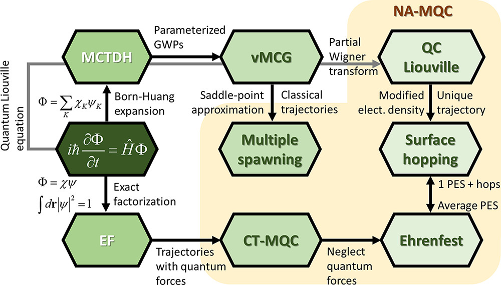
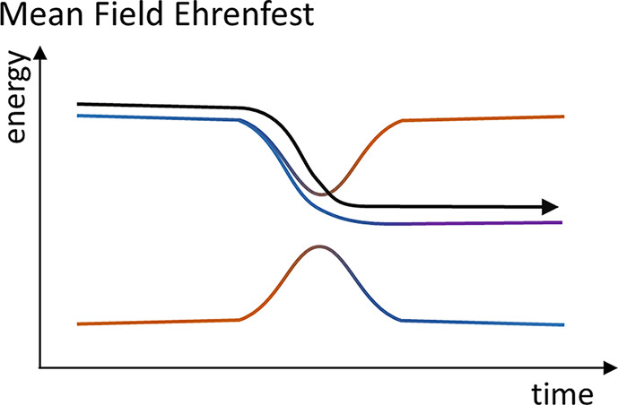
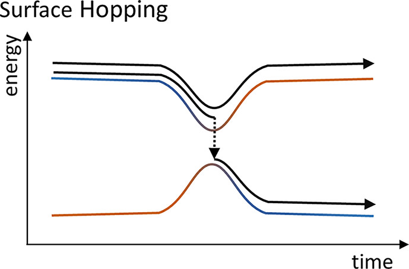
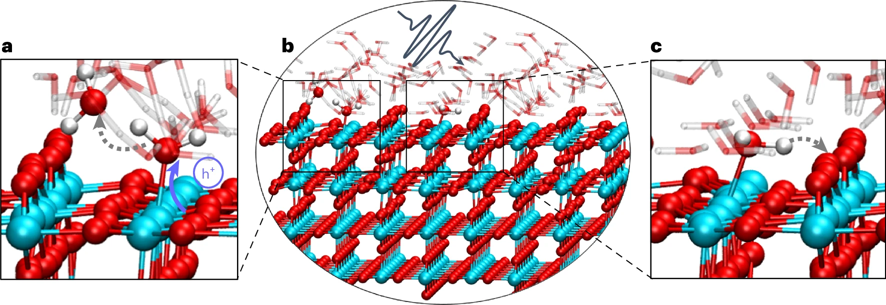
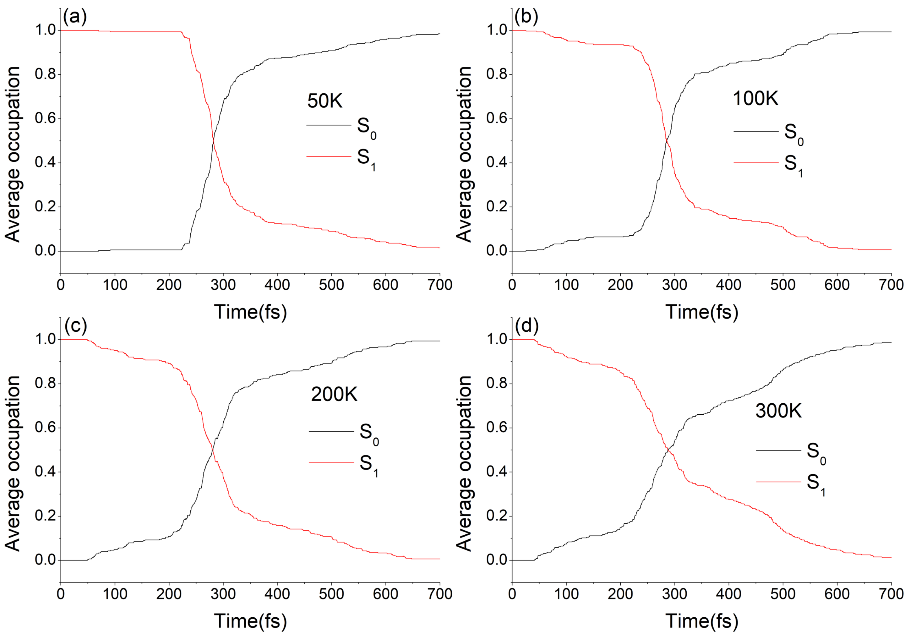
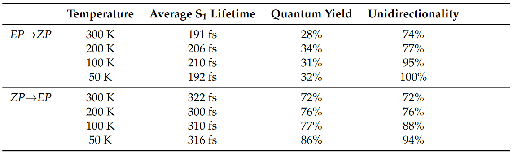
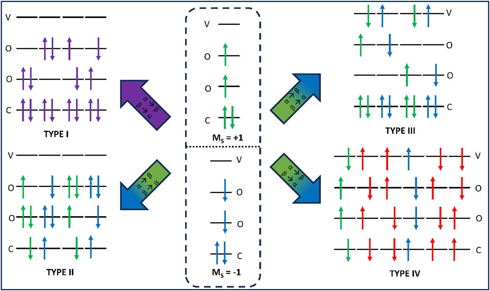

<!-- **
**非绝热混合量子-经典动力学简介**
**

**
周子杰 湖南大学化学化工学院
** -->

**摘要:** 非绝热分子动力学(Non-adiabatic Molecular dynamics)是一种脱离了波恩-奥本海默近似，并且能描述非绝热势能面的分子动力学模拟方法。这种方法被用于研究各类分子非绝热现象的时间演化，发展此类方法在理论与实验中都具有重大的意义。混合量子-经典动力学是非绝热动力学的一种实现方法。该方法将体系分为两部分，一部分（通常是原子核）使用经典力学方法处理，另一部分（包括但不限于电子）采用量子力学方法处理，两部分之间通过非绝热耦合项相连接，使得该方法可以正确描述非绝热效应。本文会简要介绍非绝热动力学的应用，并重点介绍两种常用的混合量子-经典动力学方法（MFE，TSH）的实现方式以及非绝热耦合的一种计算方法。本文最后会提供一份可以做非绝热动力学计算的程序清单以供参考。
**关键词:** 理论与计算化学，量子化学，非绝热动力学，含时密度泛函理论，平均场埃伦费斯特动力学，面跳跃动力学.

## 1. 引言

&emsp;&emsp;波恩-奥本海默近似（Born− Oppenheimer approximation）是一种用于求解多原子多电子体系的常用近似方法。该方法认为电子运动的时间尺度远小于核弛豫的时间尺度，以至于当原子核发生运动时，电子能够“瞬间”响应核的运动，故可以把体系的总波函数分解成电子波函数与核波函数之积，即：

$$
\begin{equation} \Phi(r,R)=\Psi(r)\Theta(R) \end{equation}
$$

其中 $r$ 为体系中电子的坐标，$R$ 为体系中原子核的坐标，$\Psi(r)$为 B-O 近似下的电子波函数，$\Theta(R)$ 为 B-O 近似下的核波函数，两者之积为体系的总波函数 $\Phi(r,R)$ 。通过这样把电子波函数与核波函数分开，就可以简单地将定态薛定谔方程给分解成电子方程与核方程这两部分。如果将核部分采用经典力学方法来描述，电子采用量子力学方法来描述，即可得到体系在经典近似下的运动方程，即：
$$
\begin{equation}\frac{dR}{dt}=-\nabla {E}\end{equation}
$$

$$
\begin{equation}\hat{H}(r,R)\Psi(r)=E\Psi(r)\end{equation}
$$

这就是经典AIMD（Ab Initio Molecular Dynamic）框架下的体系的运动方程[^1]。 这是两组相互耦合的的方程，要想求得其解析解几乎不可能，所以大多数情况下是通过数值方法对其进行求解，即使用一些电子结构理论方法（DFT，CC，CI等）对电子运动方程（3）进行求解，得到体系的能量及其梯度，再将梯度代入核运动方程（2）中，指定时步长进行动力学走步，从而得到新的核坐标，再由核坐标得到新的电子哈密顿，如此循环往复。在使用 Berendsen 热浴[^32]的正则系综（ NVT 系综）下 AIMD 的一般步骤如下：

1. 提供初始坐标并通过玻尔兹曼分布随机生成初始速度。
2. 在初始坐标下进行电子结构计算，输出能量与能量梯度。
3. 根据定义的时间步长与上一步速度信息对运动方程进行积分，并更新核坐标与速度。
4. 根据恒温器温度，给速度乘上一个校正因子，以控制温度（Berendsen 热浴[^32]）。
5. 若传播时间已达到预设定的时间，则停止传播并输出结果；若未达到设定的时间，则利用新的核坐标与速度重新进行 2-4 步。

&emsp;&emsp;虽然 B-O 近似下的 AIMD 编程简单，对电子结构方法的要求低（只要求所用电子结构方法可以产生能量梯度），计算速度快（一次走步只需计算能量与梯度），能成功地描述许多化学过程，但是该方法无法描述势能面发生变化的过程。从方程（3）也可以看出，在 B-O 近似下体系能量只是核坐标的函数，即体系在相空间只能位于给定电子态的绝热势能面上，所以经典的AIMD无法描述电子态会随时间发生变化的过程，如非辐射跃迁过程，电子转移过程等。

&emsp;&emsp;分子、超分子组装体和固体中的光化学和光物理现象涉及电子群体通过多种电子态的时间演化过程。由于这些过程的时间尺度非常小，以至于基于绝热近似的动力学方法通常不适合描述这些过程，所以要对这些过程进行建模就需要考虑绝热状态之外的核运动和电子运动之间的耦合，也就是考虑非绝热耦合。不同于基于绝热近似与 B-O 近似的AIMD，混合量子-经典动力学作为非绝热动力学的一种实现方式，可以合理的考虑非绝热耦合效应，并且还能够考虑一定的核量子效应[^2]，耗时也比做全量子动力学计算低得多，已经被广泛用于描述分子开关的开合[^3][^4][^5][^6][^7]、分子马达的旋转[^8][^9][^10]、分子聚集体的能量转移[^11][^12][^13]以及各种发色团的超快非辐射跃迁过程[^14][^15]，并取得了非常好的结果。关于其他非绝热动力学的应用，可以参考综述[^16]。

&emsp;&emsp;非绝热动力学有多种实现方式，理论精度最高的一类方法是全量子动力学，如多组态含时 Hartree[^17](Multi-Configuration Time-Dependent Hartree，MCTDH)。MCTDH 精度很高，通常用作衡量其他方法精度的参考方法，但是 MCTDH 在计算时需要用到体系的高精度势能面以及非绝热耦合矩阵元，故在实际应用中往往有着很大的限制。目前真正能用于解决实际物理化学问题的一类方法是混合量子-经典动力学方法，如轨迹面跳跃方法[^18][^19]（Trajectory Surface Hopping，TSH）、平均场埃伦费斯特动力学[^20][^21](Mean-Field Ehrenfest dynamics，MFE)、混合量子-经典刘维尔方程[^22]（mixed Quantum−Classical Liouville Equation，QCLE）、耦合轨迹混合量子-经典方法[^23]（coupled-trajectories mixed quantum−classical，CT-MQC）、从头算多次产生方法[^24][^25](Ab initio Multiple Spawning，AIMS)等。图1为一些非绝热动力学方法的示意图。这类方法或多或少舍弃了部分计算精度，以获得计算速度的提升，做到了精度与耗时之间的良好平衡。本文的第二部分将会着重介绍 MFE，TSH 这两种方法。

**图1. 一些非绝热动力学方法的关系图。从精确的含时薛定谔方程开始，通过对总波函数进行展开（Born-Huang 展开或精确因式分解）来将电子变量与核变量分离，得到量子动力学方法，再通过引入近似，将核运动用经典方式进行表述，得到混合量子-经典动力学方法。图源自参考文献[^28]**

&emsp;&emsp;由于考虑了非绝热效应，混合量子-经典动力学的运动方程与 AIMD 的运动方程通常会有所不同。如 MFE，TSH 的核运动方程仍采用经典形式，但电子方程与方程（3）相比多了一项（见下文），这一项被成为非绝热耦合项。不难看出，非绝热耦合项是非绝热的电子运动方程与绝热近似下的电子运动方程的差异，反映了非绝热效应的强弱，即非绝热耦合越大，体系偏离绝热近似的程度就越大。非绝热耦合的计算在整个非绝热动力学传播的过程中非常关键，其计算精度与计算时间取决于所使用电子结构方法的精度。能计算非绝热耦合的电子结构方法有很多[^26]，如运动方程耦合簇理论（Equation of Motion-Couple Cluster，EOM-CC）、含时密度泛函理论（Time-Dependent Density Function Theory，TDDFT）、多组态自洽场方法（Multi-Configuration Self-Consistent Field，MCSCF）等。文章的第三部分会对最常用的 TDDFT 的线性响应形式（Linear Response TDDFT，LR-TDDFT）做一个详细介绍。

## 2. 非绝热动力学介绍

&emsp;&emsp;众所周知，考虑绝热近似的时候，总波函数可以直接展开成核波函数与电子波函数之积，但绝热近似在很多情况下并不是一个好的近似。为了化简运动方程，我们需要考虑其他的展开方式，如 MFE 与 TSH 采用了平均场近似[^27]，AIMS 采用了 Born-Huang 展开[^25]等。虽然展开方式不同，但是这三种方法都是采用经典方式来处理核运动。不同的是，MFE 与 TSH 将核运动近似成大量经典轨迹的平均，而 AIMS 把核运动展开成经典轨迹的高斯波包，以高斯波包的形式对核运动进行传播[^24]。每种方法各有各的优势，下面会一一介绍这些。

#### 2.1 平均场埃伦费斯特动力学(Mean-Field Ehrenfest dynamics，MFE)

&emsp;&emsp;在不考虑相对论效应的情况下，纯态体系的运动方程为含时薛定谔方程
$$
\begin{equation} i\hbar\frac{\partial \Phi}{\partial t}(r,R,t) = \hat{H}\Phi(r,R,t) \end{equation}
$$

其中$\hat{H}$是体系的哈密顿算符。$\Phi$是体系的总波函数，波函数有三个变量，电子坐标 $r$、核坐标 $R$ 和时间 $t$。对于分子体系，哈密顿算符的形式如下
$$
\begin{equation}\begin{aligned}\hat{H} &=-\sum_R\frac{\hbar^2}{2M_R}\nabla^2_R-\sum_r\frac{\hbar^2}{2m_r}\nabla_r^2+\sum_{i<j}\frac{Z_iZ_j}{|R_i-R_j|}-\sum_{i,j}\frac{Z_j}{|r_i-R_j|}+\sum_{i<j}\frac{1}{|r_i-r_j|} \\\
& =\hat{K}_n+\hat{K}_e+\hat{V}(r,R)=\hat{K}_n+\hat{H}_e\end{aligned}\end{equation}
$$

其中第一项代表核动能$\hat{K}_n$，第二项代表电子动能$\hat{K}_e$，后面三项分别代表核-核相互作用能，核-电子相互作用能和电子-电子相互作用能，三项之和记作$\hat{V}(r,R)$，电子哈密顿量记为$\hat{H}_e=\hat{K}_e+\hat{V}(r,R)$。为了求解这个方程，首先要对总波函数进行分离变量。对于平均场近似，可以将总波函数进行如下分解：

$$
\begin{equation}\Phi(r,R,t) = \Psi(r,t)\Theta(R,t)\exp(\frac{i}{\hbar}\int_{t_0}^tdt'E_e(t'))\end{equation}
$$

其中$E_e(t)=\int \Psi^*\Theta^* \hat{H}_e \Psi \Theta drdR=\braket{H_e}$。将方程（5）代入（4）中，两边同时除以$\exp(\frac{i}{\hbar}\int_{t_0}^tdt'E_e(t'))$，可得

$$
\begin{equation} i\hbar(\Psi\frac{\partial \Theta}{\partial t}+\frac{\partial \Psi}{\partial t}\Theta)-E_e\Psi\Theta=\Psi(\hat{K}_n\Theta)+(\hat{K}_e\Psi)\Theta+\hat{V}\Theta\Psi \end{equation}
$$

两边同时左乘$\Theta^*$，由波函数的归一性，可得
$$
\begin{equation}i\hbar\frac{\partial \Psi}{\partial t}+i\hbar\bra{\Theta}\frac{\partial}{\partial t}\ket{\Theta}\Psi=\hat{K}_e\Psi+\bra{\Theta}\hat{K}_n+\hat{V}\ket{\Theta}\Psi+E_e\Psi\end{equation}
$$

由于$\frac{\partial}{\partial t}=\vec{v}·\nabla$，所以[^27]

$$
\begin{equation}\bra{\Theta}i\hbar\frac{\partial}{\partial t}\ket{\Theta}=\bra{\Theta}i\hbar\vec{v}·\nabla\ket{\Theta}=\vec{v}·\bra{\Theta}i\hbar\nabla\ket{\Theta}=\vec{v}·\braket{\vec{p}}=E\end{equation}
$$

将（8）代入（7）中，注意到$E=E_e+\braket{K_n}$，可得
$$
\begin{equation}i\hbar\frac{\partial \Psi}{\partial t}=\hat{K}_e\Psi+\bra{\Theta}\hat{V}\ket{\Theta}\Psi\end{equation}
$$

这就是电子波函数的运动方程。不难看出，方程（9）与原来的含时薛定谔方程（4）相比，原本的势能算符$\hat{V}$被替换成了势能的平均值$\bra{\Theta}\hat{V}\ket{\Theta}$，因此这种做法被称为平均场（Mean-Field）。同理，可以推出核波函数的运动方程为
$$
\begin{equation}i\hbar\frac{\partial \Theta}{\partial t}=\hat{K}_n \Theta+\bra{\Psi}\hat{H}_e\ket{\Psi}\Theta\end{equation}
$$

从（10）和（11）两式中不难看出，在平均场近似下，原子核等效地在电子所形成的平均场中运动，电子等效地在核所形成的平均场中运动，这便是平均场近似的实质。将核波函数分为两部分，即
$$
\begin{equation}\Theta(R,t)=A(R,t)\exp[\frac{i}{\hbar}S(R,t)]\end{equation}
$$

其中$A$为振幅，$S$为相因子。将（12）代入方程（11）中，化简可得[^29]
$$
\begin{equation}\frac{\partial S(R,t)}{\partial t}=\frac{1}{A(R,t)}\hat{K}_nA(R,t)-\frac{1}{2}\sum\frac{1}{M_R}(\nabla_RS(R,t))^2-E_e(R)\end{equation}
$$

若$\hbar\to 0$，则$\hat{K}_n=\sum_R\frac{\hbar^2}{2M_R}\nabla_R\to0$，则方程（13）变为
$$
\begin{equation}\frac{\partial S(R,t)}{\partial t}=-\frac{1}{2}\sum\frac{1}{M_R}(\nabla_RS(R,t))^2-E_e(R)\end{equation}
$$

这便是经典力学中的哈密顿-雅可比方程[^30]，其中 $S$ 被成为哈密顿主函数。由 Ehrenfest 定理[^31]可知，$\hbar\to0$代表着体系由量子描述转向经典描述，方程（14）就是方程（11）的经典对应。由哈密顿力学可知，哈密顿-雅可比方程与牛顿运动方程是完全等价的，所以我们可以把方程（14）改写成我们熟悉的形式，即
$$
\begin{equation}M_R\frac{d^2 R}{dt^2}=-\nabla_RE_e(t)\end{equation}
$$

对于经典的核运动图像，核就是一个没有大小的质点，所以核的密度函数就是为多个狄拉克$\delta$函数之和，即
$$
\begin{equation}|\Theta(R)|^2=\sum_{R_0}\delta(R_0-R)\end{equation}
$$

故
$$
\begin{equation}E_e(t)=\int \Psi^*\Theta^* \hat{H}_e \Psi \Theta drdR=\sum_{R_0}\int \Psi^*\hat{H}_e \Psi \delta(R_0-R) drdR=\sum_{R_0}\braket{H_e}|_{R=R_0}\end{equation}
$$

这就是 Ehrenfest 框架下原子核运动的经典表述，即原子核在各电子态的绝热势能面的平均势能面上运动，如下图所示

**图2. MFE 的示意图，可以看到，在 MFE 框架下，原子核实际上是在所有电子态的平均势能面（黑线）上运动的。图源自参考文献[^28]**。

&emsp;&emsp;接下来我们来讨论电子运动方程（10）。为了求解这种偏微分方程，最简单的方法就是对方程进行分离变量，考虑到绝热电子态的波函数具有完备性，可以将电子波函数在绝热表象下展开，即
$$
\begin{equation}\Psi(r,t;R)=\sum_ic_i(t)\psi_i(r;R)\end{equation}
$$

其中 $\psi_i(r;R)$ 是第 $i$ 个 B-O 近似下的电子的绝热波函数，对应方程$\hat{H}\psi_i=E_i\psi_i$ 。式（16）的物理意义十分明显：将电子波函数表示成各绝热波函数的加权平均，权重记为$c_i(t)$。将（18）代入方程（10），可得
$$
\begin{equation}i\hbar\sum_i(\psi_i\frac{d c_i}{dt}+c_i\frac{\partial \psi}{\partial t})=\sum_ic_i(\hat{K}_e+\bra{\Theta}\hat{V}\ket{\Theta})\psi_i\end{equation}
$$

两边同时左乘$\psi_j$，由绝热波函数的正交归一性，可得
$$
\begin{equation}\begin{aligned}i\hbar\frac{dc_j}{dt}&=\sum_ic_i\Big(\bra{\psi_j}\hat{K}_e+\bra{\Theta}\hat{V}\ket{\Theta}\ket{\psi_i}-i\hbar\bra{\psi_j}\frac{\partial }{\partial t}\ket{\psi_i}\Big)\\ &=\sum_ic_i(H_{ij}-i\hbar\vec{d}_{ij}·\vec{v})\end{aligned}\end{equation}
$$

其中$H_{ij}=\bra{\psi_j}\hat{K}_e+\bra{\Theta}\hat{V}\ket{\Theta}\ket{\psi_i}$ 为电子在平均场下的哈密顿算符的矩阵元。对于经典近似，$\bra{\Theta}\hat{V}\ket{\Theta}=V(r,R_0)$，所以在经典近似下，平均场哈密顿算符的矩阵元就等于给定核坐标的情况下电子哈密顿算符的矩阵元。$\vec{d}_{ij}=\bra{\psi_j}\nabla_R\ket{\psi_i}$ 被称为非绝热耦合矢量，可以用来衡量体系偏离绝热近似的程度。$\vec{v}$ 为核的速度矢量。方程（20）可以方便地用于数值求解。在求解出权重$\{c_i(t)\}$之后，代入方程（18）就能得到 MFE 框架下的电子波函数了。

&emsp;&emsp;从方程（15）和方程（20）可以看出，想要对核坐标进行传播，就得先得到平均能量及其梯度，想要得到能量，就要得到电子波函数的表达式，想要得到电子波函数，就得得到绝热波函数并求解方程（20），而想求解方程（20）就得得到矩阵元 $H_{ij}$ 、非绝热耦合矢量 $\vec{d}_{ij}$ 以及核速度 $\vec{v}$。所以，综上所述，进行 MFE 动力学计算的简单步骤如下：

1. 由给定的核坐标与简正模式通过一系列方法（如通过对 Wigner 分布进行采样）生成初始坐标与初速度。
2. 在该初始坐标下求解电子的薛定谔方程。
3. 通过所解得的电子的绝热波函数计算哈密顿矩阵元 $H_{ij}$ 与非绝热耦合矢量 $\vec{d}_{ij}$ 。
4. 求解方程（20），得到体系总电子波函数的表达式。
5. 通过总电子波函数，求的体系的平均能量及其梯度。
6. 将能量梯度代入核运动方程（15），根据给定的时间步长，通过数值积分进行动力学走步，得到新的核坐标与和速度。
7. 若传播时间已达到设定的时间，则输出结果并结束走步；若未达到设定的时间，则利用新的核坐标与速度重新进行 2-6 步。

#### 2.2 轨迹面跳跃动力学(Trajectory Surface Hopping，TSH)

&emsp;&emsp;TSH 早在1971年就被 Tully 提出[^19]，直到1990年，TSH 的一个变体——最少面跳跃方法（Fewest Switch Surface Hopping，FSSH）[^18]被提出后，TSH 才被广泛地应用于非绝热现象的描述中。由于其形式简单，容易实现，所以 FSSH 是目前最流行的非绝热动力学方法之一[^28]。TSH 与 MFE 的不同之处在于，MFE 考虑非绝热效应的方式是让原子核在各绝热电子态的平均势能面上运动，而 TSH 考虑非绝热效应的方式是让原子核能在各绝热势能面之间进行 “跳跃” 。TSH 在经典 AIMD 的基础上加上了面跳跃机制，使得核能在不同势能面上运动，从而对非绝热现象进行描述。下面会介绍 TSH 的常用变体—— FSSH 的具体实现方法。

&emsp;&emsp;与 MFE 的推导过程类似，最后所得到的体系的核运动方程仍为（15），电子运动方程仍为（20），但是物理意义有些许不同。
$$
\begin{equation}M_R\frac{d^2 R}{dt^2}=-\nabla_RE_{LL}\end{equation}
$$

$$
\begin{equation}i\hbar\frac{dc_J}{dt}=\sum_Lc_L(H_{LJ}-i\hbar\vec{d}_{LJ}·\vec{v})\end{equation}
$$

其中$E_{LL}$为体系所处绝热电子态的能量函数。方程（21）表明，原子核实际上是在某一绝热势能面上运动。而方程（22）中的$\{c_J\}$决定了电子在势能面之间跳跃的概率。在 FSSH 框架中从第 $L$ 个面跳跃到第 $J$ 个面的概率表达式如下[^28]
$$
\begin{equation}\begin{aligned}P_{L\to J}&=max\Big[0,\frac{2\Delta t}{|c_L|^2}(\hbar^{-1}Im(H_{LJ}c_Jc_L^*)-Re(\vec{d}_{LJ}·\vec{v}c_Jc_L^*))\Big]\\\\
&=max\Big[0,\frac{2\Delta t}{|c_L|^2}(\hbar^{-1}Im(H_{LJ}\rho_{JL})-Re(\vec{d}_{LJ}·\vec{v}\rho_{JL}))\Big]\end{aligned}\end{equation}
$$

其中 $Im$ 指对复函数取虚部，$Re$ 指对复函数取实部，$\rho_{JL}=c_jc_L^*$ 。若采用绝热表象，则哈密顿算符的非对角元为0，上式可以简化为
$$
\begin{equation}P_{L\to J}=max\Big[0,-\frac{2\Delta t}{|c_L|^2}Re(\vec{d}_{LJ}·\vec{v}\rho_{JL})\Big]\end{equation}
$$

这便是 FSSH 框架下体系在不同绝热势能面之间的跃迁概率表达式。在实际计算中，我们一般会使用随机数来确定上述跳跃事件是否发生。首先产生一个随机数 $r_t\in[0,1]$，若 $r_t$ 满足以下关系[^28]
$$
\begin{equation}\sum_{K=1}^{J-1}P_{L\to K}<r_t<\sum_{K=1}^{J}P_{L\to K}\end{equation}
$$

则核就会从原来的第 $L$ 个势能面跳跃到第 $J$ 个势能面上，示意图如下图所示。

**图3. TSH 的示意图，可以看出 TSH 实际上相当于在多个绝热势能面上进行 AIMD 模拟，跃迁概率由（24）决定。可以看到，跃迁概率正比于非绝热耦合的值，即两个势能面间的非绝热耦合越大，更容易发生跃迁。或者不严谨地说，两个势能面越接近，跃迁概率越大。图源自参考文献[^28]**。

&emsp;&emsp;由于其编程简单，对电子结构方法的要求低（只需要能输出能量，能量梯度以及非绝热耦合）所以 FSSH 成为了目前应用最广泛的非绝热动力学方法之一。需要注意的是，由于引入了随机数，每一条面跳跃动力学的轨迹都具有随机性，在实际计算的时候需要计算大量轨迹再对其进行平均以消除随机性，并提高精度，这就对所用电子结构方法的计算速度有着很高的要求了。幸运的是，由于 TSH 的计算需要大量轨迹求平均，所以动力学传播的时间步长不需要特别短，0.1-0.5 fs 的动力学步长足以应对大部分体系[^28]。综上所述，做 FSSH 计算的简单步骤如下：

1. 由给定的初始坐标与简正模式信息通过一系列方法（如对 Wigner 分布进行采样）得到一组初始条件
2. 在该初始坐标下求解电子的薛定谔方程，得到各绝热势能面的波函数与能量。
3. 计算各个势能面间的非绝热耦合矢量，并计算当前势能面下的能量梯度。
4. 求解方程（22），得到各绝热势能面的权重，并计算各个面之间的跃迁概率。
5. 将能量梯度代入核运动方程（21），根据给定的时间步长，通过数值积分进行动力学走步，得到新的核坐标与和速度。
6. 产生随机数，通过式（25）确定是否改变体系所处绝热势能面。
7. 若传播时间已达到设定的时间，则输出结果并结束走步；若未达到设定的时间，则利用新的核坐标与速度重新进行 2-6 步。

#### 2.3 非绝热动力学的应用举例

&emsp;&emsp;非绝热动力学的一个重要应用就是对光物理化学过程的合理描述。众所周知，光物理化学过程由于伴随着光子的吸收与释放，导致电子波函数会在不同的绝热势能面之间跃迁，所以经典 AIMD 这种只能在一个绝热势能面上运动的动力学方法在面对这些光物理化学过程时显得无能为力，而非绝热动力学方法可以很好地描述这些过程。中科院孟胜团队使用实时密度泛函理论（Real-Time TDDFT，RT-TDDFT）研究水在金红石（110）表面上的光解[^33]。通过第一原理非绝热光激发动力学，作者揭示了光生载流子的微观路径以及纠缠电子核运动如何在水解离中发挥关键作用，并发现电子和原子核之间的相互作用导致两种不同的水解离途径。作者发现动态极化子参与空穴驱动的水解离，强调了光催化中相关电子-核运动的重要性，这一特征也可能在其他材料（例如钙钛矿）的光催化性能中发挥重要作用。

**图4. TiO2/水界面的原子构型和反应机理。 a，空穴诱导分裂动力学中的电荷流示意图。蓝色和虚线箭头分别表示空穴电流和空穴传输的方向。 b，TiO2/水界面的原子结构，包含四层TiO2板和30个水分子。 c，场引发的分裂动力学示意图。虚线箭头表示质子转移的方向。白色、红色和蓝色的球分别表示氢、氧和钛原子。图源自参考文献[^33]**。

&emsp;&emsp;非绝热动力学作为一种动力学方法，和其他动力学方法一样，都能得到体系的各种性质随时间的演化，例如坐标、速度、偶极矩矢量、粒子数布居等。有了这些数据，再通过线性响应理论或者涨落-耗散定理就可以计算体系的一些输运性质[^34]，如扩散系数、反应速率常数、红外光谱的谱密度等。对于光化学反应，最重要的一些数据是该反应的各种量子产率、速率常数以及激发态寿命，我们可以可以通过非绝热动力学方法从第一性原理来预测来预测这些数据。西安交通大学李福利、蒋臣威团队与华南师范大学兰峥岗团队使用半经验方法 OM2/MRCI 结合 FSSH 对一种光控分子马达进行了非绝热动力学模拟[^10]。在文章中，作者系统地研究了温度对 DDPY EP→ZP和ZP→EP光异构化非绝热动力学的影响。研究表明，EP→ZP 和 ZP→EP 光异构化的量子产率与 $S_1$ 激发态的平均寿命几乎与温度无关，而相应的旋转单向性随着温度降低而显着增加（表1）。

**图5. 分子马达 DDPY 的 ZP→EP 光异构化过程中电子态 S0 和 S1 在不同温度下的平均占有率随模拟时间的变化，温度分别为 (a) 50 K、(b) 100 K、(c) 200 K 和 (d) 300 K 。图源自参考文献[^10]**。

**表1. 分别在 300 K、200 K、100 K 和 50 K 下的 EP→ZP 和 ZP→EP 光异构化的平均 S1 寿命、量子产率和单向性。图源自参考文献[^10]**。

&emsp;&emsp;需要注意的是，对于一些光化学速率常数，并不是必须要通过非绝热动力学方法来计算。这些速率常数可以通过一些“静态”的方法计算，如 ORCA[^47] 的 ESD 模块可利用体系基态与激发态的振动模式通过路径积分理论计算这些光化学速率常数[^48][^49]。

#### 2.4 非绝热动力学可用软件举例

|程序名|是否需要外接电子结构程序|可用非绝热动力学方法|备注|
|:----:|:----:|:----:|:----:|
|[Newton-X](https://newtonx.org/)[^35]|是|FSSH|可通过外接 CP2K 实现周期性边界条件|
|[SHARC](https://sharc-md.org/)[^36]|是|FSSH、SHARC||
|[Molpro](https://www.molpro.net/)[^37]|否|AIMS|收费|
|[Gamess](https://www.msg.chem.iastate.edu/gamess/index.html)[^38]|否|AIMS||
|[MLatom](https://xacs.xmu.edu.cn/docs/mlatom/index.html)[^39]|否|FSSH|可以通过 XACS 云平台线上使用|
|[ANT](https://comp.chem.umn.edu/ant/)[^40]|是|FSSH、MFE、FSTU 等|需要提供解析势能面|
|[GPAW](https://wiki.fysik.dtu.dk/gpaw/index.html)[^41]|否|MFE|支持周期性边界条件||
|[Q-Chem](https://www.q-chem.com/)[^42]|否|FSSH、A-FSSH|收费|
|[PyUNIxMD](https://github.com/skmin-lab/unixmd)[^43][^45]|是|MFE、FSSH 等|
|[TDAP](https://tdap.iphy.ac.cn/)[^44]|是|MEF|支持周期性边界条件|

**表2. 部分可以进行非绝热动力学计算的软件。图表部分改编自参考文献[^28][^46]**。

&emsp;&emsp;从表2上可以看到，不同的软件支持着不同的方法。我们需要根据所研究的体系与想得到的性质来确定使用哪一种软件或方法。如果想研究固体表面的非绝热过程，可以使用 Newton-X 结合 CP2K[^50] 做 FSSH 模拟；如果想研究的过程不涉及 $S_1/S_0$，交叉，则可选用 LR-TDDFT 作为电子结构与非绝热耦合的计算方法；如果想自己训练机器学习势来进行模拟，则可使用 MLatom 来进行 FSSH 模拟；如果想要研究的体系较大，且具有很强的多参考态特征，推荐使用 MNDO 中的 $OM_x/MRCI$ 方法[^51]或者将在 ORCA 6.1中推出的 NOTCH[^52] 方法来作为电子结构计算与非绝热耦合计算的方法。每一种方法都有自己的优缺点，需要根据所研究的体系与拟计算的性质来选择合适的方法。

## 3. 含时密度泛函理论简介

&emsp;&emsp;在2.1、2.2推导公式的过程中，我们可以看到，绝热波函数与非绝热耦合矢量的计算是整个动力学过程中最关键的一步。非绝热混合量子-经典动力学的精度很大一部分都取决于电子结构计算的准确程度。电子结构的准确描述的动力学模拟合理的前提，整个动力学模拟的耗时很大一部分也都是由电子结构计算部分来决定。能计算非绝热耦合的方法有很多，最常用的方法就是含时密度泛函理论（Time-Dependent Density Function Theory，TDDFT）。TDDFT 的耗时与其精度相平衡，因此被广泛应用于激发态的计算中。TDDFT 有多种实现形式，如实时密度泛函理论（Real-Time TDDFT，RT-TDDFT）、自旋翻转密度泛函理论（Spin-Flip TDDFT，SF-TDDFT）、线性响应密度泛函理论（Linear-Response TDDFT，LR-TDDFT）等。下面我们将会介绍 TDDFT 最简单，但应用最广泛的一种实现方式——LR-TDDFT。

#### 3.1 密度泛函理论简介

&emsp;&emsp;本小节中我们会对密度泛函理论进行简单地回顾，简单过一遍 DFT 的核心思想并且简要介绍 KS 方程的推导。本小节并不会涉及太多细节性的步骤，对于这些步骤，可以参考专门的 DFT 综述[^53][^54]。
&emsp;&emsp; DFT 的核心思想就是要获得以电子密度为自变量的体系能量的泛函，然后对能量泛函求变分，得到能使能量泛函到达最低点的电子密度，该电子密度所对应的波函数就是体系真正的波函数[^53]。能量泛函的一般形式如下：
$$
\begin{equation}E[\rho]=T[\rho]+V_{NN}+V_{eN}[\rho]+J[\rho]+E_{XC}[\rho]\end{equation}
$$

$$
\begin{equation}V_{NN}=\sum_{i<j}\frac{Z_iZ_j}{|R_i-R_j|}\end{equation}
$$

$$
\begin{equation}V_{eN}[\rho]=\sum_{j}\int\frac{\rho(r)}{|r-R_j|} dr\end{equation}
$$

$$
\begin{equation}J[\rho]=\int\frac{\rho(r_1)\rho(r_2)}{|r_1-r_2|} dr_1dr_2\end{equation}
$$

其中 $V_{NN}$ 是核-核相互作用能，在核固定的情况下为一常数；$V_{eN}[\rho]$ 代表核-电子相互作用能；$J[\rho]$ 为库伦泛函，是电子-电子相互作用的近似值；$E_{XC}[\rho]$ 为交换-相关能泛函，交换相关泛函加上库伦泛函等于精确的双电子相互作用能；$T[\rho]$ 为动能泛函。由于动能泛函的形式未知，所以直接对电子密度 $\rho$ 求变分并不容易，因此 DFT 在被提出后有一段时间无人问津，直到 Kohn 和 Sham 提出了 KS 拟设之后，DFT才被人们广泛应用于描述实际体系中[^55]。

&emsp;&emsp;Kohn、Sham 假设电子密度可以表示出一组类似于自旋轨道的标准正交基之和，即
$$
\begin{equation}\rho(r)=\sum_i^N\int|\psi_i(r,\sigma)|^2d\sigma\end{equation}
$$

其中 $r$ 为电子坐标，$\sigma$ 为电子的自旋变量，$N$ 为体系的总电子数，这一组函数 $\{\psi_i\}$ 被称为 KS 轨道。相应的动能泛函的形式可以被写出：（使用原子单位制）
$$
\begin{equation}T[\rho]=\sum_i^N\bra{\psi_i}-\frac{1}{2}\nabla^2\ket{\psi_i}\end{equation}
$$

于是，能量泛函可以被表示成 KS 轨道的泛函，能量泛函（26）中的未知项仅剩下交换-相关泛函 $E_{XC}[\rho]$ 。根据拉格朗日乘子法，设辅助泛函的形式为
$$
\begin{equation}\mathscr{L}[\rho]=E[\rho]-\sum_{i,j}^N\lambda_{ij}(\braket{\psi_i|\psi_j}-\delta_{ij})\end{equation}
$$

其中辅助泛函的第一项为能量泛函；第二项为限制条件，代表 KS 轨道 $\{\psi_i\}$ 被限定为单位正交基；$\lambda_{ij}$ 为拉格朗日乘子。由变分原理可得

$$
\begin{equation}\frac{\delta\mathscr{L}}{\delta\psi_i}=0\end{equation}
$$

将辅助泛函（32）代入，即可得到方程[^55]

$$
\begin{equation}\hat{H}_{KS}\psi_i=\sum_{ij}\lambda_{ij}\psi_j\end{equation}
$$

$$
\begin{equation}\hat{H}_{KS}=-\frac{1}{2}\nabla^2+\sum_i\frac{Z_i}{|r-R_i|}+\frac{\delta J[\rho]}{\delta \rho}+\frac{\delta E_{XC}[\rho]}{\delta \rho}\end{equation}
$$

由于电子密度 $\rho$ 对占据轨道的酉变换具有不变性，所以 KS 算符也具有酉变换下的不变性，所以我们往往可以选择一组 KS 轨道使得 $\lambda_{ij}$ 为对角矩阵，我们可以将 方程（34）改写为

$$
\begin{equation}\hat{H}_{KS}\psi_i=\varepsilon_i\psi_i\end{equation}
$$

方程（36）即为 KS 方程，其中 $\psi_i$ 是 KS 算符的本征函数，被称为 KS 轨道；$\varepsilon_i$ 即为 $\psi_i$ 所对应的本征值。对于精确地交换相关泛函，可以证明，最高占据轨道所对应的本征值等于分子第一电离能的负值，所以该本征值有着“轨道能量”的物理图像，但是对于近似的交换相关泛函，它们并不严格相等，所以轨道本征值的物理意义在大多数情况下不是很明确。对于近似交换相关泛函，可以认为本征值为电离能的近似值[^55]，但是其值严重依赖于近似交换相关泛函的具体形式。通过求解方程（36）我们可以得到一组 KS 轨道，通过 KS 轨道可以求得体系的电子密度，有了电子密度，就能很容易地求出 DFT 框架下的绝大多数物理量。

&emsp;&emsp;需要注意的是，引入轨道这一步只是为了方便之后推导，轨道这一概念对于整个 DFT 框架并不是必要的。只要我们能给出合理的动能泛函，就能完全避免引入轨道这一概念。事实上，确实有一种方法可以完全避免引入轨道，那就是无轨道密度泛函理论（Orbital-Free Density Functional Theory，OF-DFT）。近些年来，由于计算机的算力的不断提高，OF-DFT 也逐渐地被人们重视起来。关于 OF-DFT 的详细讨论请见综述[^56]。

#### 3.2 TD-KS 方程及其矩阵形式的推导

&emsp;&emsp;类似于含时薛定谔方程（4），对于 KS-DFT ，我们可以从（4）推导得到含时 KS 方程[^57]，即（下面使用原子单位制）
$$
\begin{equation}\hat{H}_{KS}\Psi_i=i\frac{\partial}{\partial t}\Psi_i\end{equation}
$$

可以看到，含时 KS 方程（37）的形式与含时薛定谔方程（4）的形式非常相似。由于 KS 方程（36）的解 $\{\psi_i\}$ 具有完备性，可以将（37）的解用 $\{\psi_i\}$ 展开，即
$$
\begin{equation}\Psi_i=\sum_ac_a^{(i)}(t)\psi_a\end{equation}
$$

将（38）代入（37）中，并左乘 $\psi_b$ ，由 KS 方程解的正交归一性，可得
$$
\begin{equation}i\frac{\partial c^{(i)}_b}{\partial t}=\sum_aF_{ab}c_a^{(i)}\end{equation}
$$

其中 $F_{ab}=\bra{\psi_b}\hat{H}_{KS}\ket{\psi_a}$ 为 KS 轨道基下的 KS 算符的矩阵元。式（39）还能写成矩阵形式，即
$$
\begin{equation}i\frac{\partial}{\partial t}\mathbf{C}=\mathbf{FC}\end{equation}
$$

方程（40）就是含时 KS 方程的矩阵形式。我们还可以进一步化简，将方程（40）改写成密度矩阵的形式。给方程（40）两边同时右乘 $\mathbf{C}^+$ 可得
$$
\begin{equation}(i\frac{\partial}{\partial t}\mathbf{C})\mathbf{C}^+=\mathbf{FC}\mathbf{C}^+\end{equation}
$$

对方程（40）取厄米共轭，再同时左乘 $\mathbf{C}$ ，可得
$$
\begin{equation}\mathbf{C}(-i\frac{\partial}{\partial t}\mathbf{C}^+)=\mathbf{C}\mathbf{C^+}\mathbf{F}^+\end{equation}
$$

让（41）减去（42）可得
$$
\begin{equation}i\Big[(\frac{\partial}{\partial t}\mathbf{C})\mathbf{C}^++\mathbf{C}(\frac{\partial}{\partial t}\mathbf{C}^+)\Big]=\mathbf{FCC}^+-\mathbf{CC}^+\mathbf{F}^+\end{equation}
$$

注意到方程方程坐标符合复合函数的求导法则，由 KS 矩阵在厄米共轭下的不变性，可得
$$
\begin{equation}i\frac{\partial \mathbf{P}}{\partial t}=\mathbf{FP-PF}\end{equation}
$$

其中 $\mathbf{P}=\mathbf{CC}^+$ 为体系的密度矩阵。方程（44）就是含时 KS 方程（37）的密度矩阵表示。

#### 3.3 LR-TDDFT 方程的推导

&emsp;&emsp;前面铺垫了这么多，现在让我们从方程（44）来推导出 LR-TDDFT 方程，即在外场微扰下的响应方程。不失一般性，我们可以设外界对体系的微扰是单色光的形式，所以微扰算符的矩阵元可以设为
$$
\begin{equation}V_{ij}=f_{ij}e^{-i\omega t}+f_{ji}^*e^{i\omega t}\end{equation}
$$

下面用微扰论处理方程（44）。取零阶近似为无微扰时的方程，将矩阵 $\mathbf{F,P}$ 展开至一阶修正项，即
$$
\begin{equation}\mathbf{F}=\mathbf{F}^0+\mathbf{F}^1\end{equation}
$$

$$
\begin{equation}\mathbf{P}=\mathbf{P}^0+\mathbf{P}^1\end{equation}
$$

其中下标为 0 的项为零级近似项，满足方程 $\mathbf{F_0P_0-P_0F_0=0}$ ，下标为 1 的项为一阶修正项。将上式代入（44），略去二阶小量，可得
$$
\begin{equation}i\frac{\partial \mathbf{P}^1}{\partial t}=\mathbf{F^1P^0-P^0F^1+F^0P^1-P^1F^0}\end{equation}
$$

对于零阶项，我们在得到 KS 轨道后很容易求出
$$
\begin{equation}F^0_{pq}=\varepsilon_p\delta_{pq}\end{equation}
$$

$$
\begin{equation}P^0_{ij}=\delta_{ij}\end{equation}
$$

$$
\begin{equation}P^0_{ia}=P^0_{ai}=P^0_{ab}=0\end{equation}
$$

其中下标 $i,j$ 代表占据轨道，下标 $a,b$ 代表虚轨道，其他字母代表任意轨道，。对于一阶项，我们可以写出
$$
\begin{equation}F^1_{pq}=V_{pq}+\sum_{s,t}\frac{\partial F_{pq}}{\partial P_{st}}P^1_{st}\end{equation}
$$

第一项代表外加微扰对 KS 矩阵的影响，第二项代表密度矩阵变化对 KS 矩阵的影响[^57]（泰勒展开并保留一阶响应项）。由于密度矩阵是厄米矩阵，所以为了简化计算，可以将密度矩阵的一阶修正写出如下形式
$$
\begin{equation}P^1_{pq}=d_{pq}e^{-i\omega t}+d_{qp}^*e^{i\omega t}\end{equation}
$$

不难看出，对于任意 $d_{pq}$ ，（53）都能满足对厄米共轭的不变性。由密度算符的定义 $\hat{\rho}=\sum_i\ket{\psi_i}\bra{\psi_i}$ 可知，密度矩阵满足幂等性[^57]，即
$$
\begin{equation}\mathbf{PP=P}\end{equation}
$$

由于密度矩阵的幂等性是其固有性质，所以微扰前的密度矩阵与围绕后的密度矩阵均满足该关系式，即
$$
\begin{equation}\mathbf{P^0P^0=P^0}\end{equation}
$$

$$
\begin{equation}\mathbf{(P^0+P^1)(P^0+P^1)=P^0+P^1}\end{equation}
$$

展开并忽略二阶小量，可得
$$
\begin{equation}\mathbf{P^0P^1+P^1P^0=P^1}\end{equation}
$$

或者
$$
\begin{equation}\sum_r{P^0_{pr}P^1_{rq}+P^1_{pr}P^0_{rq}=P^1_{pq}}\end{equation}
$$

由（50）（51）可知，只有当 $p,q$ 分别代表一个占据轨道和一个非占据轨道时，$P^1_{pq}$才可能不为零，即
$$
\begin{equation}P^1_{ai}=d_{ai}e^{-i\omega t}+d_{ia}^*e^{i\omega t}\end{equation}
$$

$$
\begin{equation}d_{ij}=d_{ab}=0\end{equation}
$$

将（45）（52）（53）代入方程（48）中，由于 $e^{-i\omega t}$ 与 $e^{i\omega t}$ 是线性独立的，所以可以得到两个独立方程组，即
$$
\begin{equation}\begin{aligned}\sum_r\Big(f_{pr}P^0_{rq}-f_{rq}P^0_{pr}+F^0_{pr}d_{rq}-F^0_{rq}d_{pr}+\sum_{s,t}(\frac{\partial F_{pr}}{\partial P_{st}}P^0_{rq}+\frac{\partial F_{rq}}{\partial P_{st}}P^0_{pr})d_{st}\Big)=\omega d_{pq}\end{aligned}\end{equation}
$$

$$
\begin{equation}\begin{aligned}\sum_r\Big(f^*_{rp}P^0_{rq}-f^*_{qr}P^0_{pr}+F^0_{pr}d^*_{qr}-F^0_{rq}d^*_{rp}+\sum_{s,t}(\frac{\partial F_{pr}}{\partial P_{st}}P^0_{rq}+\frac{\partial F_{rq}}{\partial P_{st}}P^0_{pr})d^*_{ts}\Big)=-\omega d^*_{qp}\end{aligned}\end{equation}
$$

将（50）（51）（60）代入（61）（62），化简得
$$
\begin{equation}F^0_{aa}d_{ai}-d_{ai}F^0_{ii}+f_{ai}+\sum_{b,j}(\frac{\partial{F_{ai}}}{\partial P_{bj}}d_{bj}-\frac{\partial{F_{ai}}}{\partial P_{bj}}d^*_{jb})=\omega d_{ai}\end{equation}
$$

$$
\begin{equation}F^0_{aa}d^*_{ia}-d^*_{ia}F^0_{ii}+f^*_{ia}+\sum_{b,j}(\frac{\partial{F_{ia}}}{\partial P_{bj}}d_{bj}-\frac{\partial{F_{ia}}}{\partial P_{bj}}d^*_{jb})=-\omega d^*_{ia}\end{equation}
$$

引入记号 $x_{ai}=d_{ai}$，$y_{ai}=d^*_{ia}$，（63）（64）变为
$$
\begin{equation}F^0_{aa}x_{ai}-x_{ai}F^0_{ii}+f_{ai}+\sum_{b,j}(\frac{\partial{F_{ai}}}{\partial P_{bj}}x_{bj}-\frac{\partial{F_{ai}}}{\partial P_{bj}}y_{bj})=\omega x_{ai}\end{equation}
$$

$$
\begin{equation}F^0_{aa}y_{ai}-y_{ai}F^0_{ii}+f^*_{ia}+\sum_{b,j}(\frac{\partial{F_{ia}}}{\partial P_{bj}}x_{bj}-\frac{\partial{F_{ia}}}{\partial P_{bj}}y_{bj})=-\omega y_{ai}\end{equation}
$$

式中 KS 矩阵对密度矩阵的导数可以直接求出，具体形式见综述[^53]。为了进一步化简（65）（66），定义[^57]
$$
\begin{equation}A_{ia,jb}=\delta_{ij}\delta_{ab}(\varepsilon_a-\varepsilon_i)+(ia|jb)+(ia|f_{xc}|jb)\end{equation}
$$

$$
\begin{equation}B_{ia,jb}=(ia|bj)+(ia|f_{xc}|bj)\end{equation}
$$

则（65）（66）可以化简成如下线性方程组
$$
\begin{equation}
 \Bigg(\begin{bmatrix}
 \mathbf{A}&\mathbf{B}\\
 \mathbf{B}&\mathbf{A}\\
 \end{bmatrix}-\omega
  \begin{bmatrix}
 \mathbf{1}&\mathbf{0}\\
 \mathbf{0}&\mathbf{-1}\\
 \end{bmatrix}\Bigg)
\begin{bmatrix}
 \mathbf{X}\\
 \mathbf{Y}\\
 \end{bmatrix}=\begin{bmatrix}
 \mathbf{F}\\
 \mathbf{F^+}\\
 \end{bmatrix}
\end{equation}
$$

其中$\mathbf{X}=[x_{ai}]$，$\mathbf{Y}=[y_{ai}]$ 为密度矩阵的一阶修正（53）的展开系数所组成的矩阵；$\mathbf{F}=[f_{ai}]$ 为外界微扰的振幅所组成的矩阵，通常为有限值。从（69）可以看出，由于 $\mathbf{F}$ 矩阵为有限值，如果 $\mathbf{X,Y}$ 前的矩阵为0时，方程（69）的解就是无穷大，这种情况对应着体系与外场发生共振，所以对应的 $\omega$ 就是能与体系发生共振的单色光的频率，也就是体系激发能所对应的频率。所以我们能写出 $\omega$ 所满足的方程，即
$$
\begin{equation}
\begin{bmatrix}
 \mathbf{A}&\mathbf{B}\\
 \mathbf{B}&\mathbf{A}\\
 \end{bmatrix}
\begin{bmatrix}
 \mathbf{X}\\
 \mathbf{Y}\\
 \end{bmatrix}=\omega
  \begin{bmatrix}
 \mathbf{1}&\mathbf{0}\\
 \mathbf{0}&\mathbf{-1}\\
 \end{bmatrix}
 \begin{bmatrix}
 \mathbf{X}\\
 \mathbf{Y}\\
 \end{bmatrix}
 \end{equat}
 $$

 方程（70）就是我们要得到的 LR-TDDFT 方程。可以看到，这是一个本征值方程，通过求得该方程的本征值与本征矢，我们就能得到体系的激发能与密度矩阵的一阶修正，即激发态电子密度的一阶近似。得到了激发态波函数，我们就能得到激发态的所有性质了，如非绝热耦合，激发态梯度等。

 &emsp;&emsp;需要注意的是，LR-TDDFT 并不是任意情况下都适用。从上面的推导过程中我们可以看到， LR-TDDFT 的一个最重要的假设是微扰后的 KS 矩阵与密度矩阵都可以略去二阶及以上小量，所以使用 LR-TDDFT 进行激发态计算的一大前提就是外加微扰是一个小量。因此，LR-TDDFT 对强光场下的计算得到的结果精度一般不高，但幸运的是，在化学家们感兴趣的紫外-可见光波段中，LR-TDDFT 的精度可以被大家所接受。如果想要考察强外加场（如激光）下体系的变化，可以采用实时密度泛函理论（RT-TDDFT）。详细讨论请见综述[^46]。
 &emsp;&emsp;由于 DFT 属于单参考态方法，所以如果想研究的过程牵扯到对于多参考态性质比较强的部分（如想研究的体系接近 $S_1/S_0$ 交叉点），那么 LR-TDDFT 从原理上就不可靠，这是单参考态方法的通病。如果想要用 DFT 研究这些体系，我们可以使用自旋翻转密度泛函理论（SF-TDDFT）来进行激发态计算。SF-TDDFT 以高自旋态为参考态，通过自旋翻转算符生成一系列响应态（图6）来考虑多参考性质。关于 SF-TDDFT 的详细讨论，请见综述[^58]。需要注意的是，由于原始版本的 SF-TDDFT 有着严重的自旋污染，如果想要精确地指认个激发态的电子构型，那么可以使用 SF-TDDFT 的无自旋污染变体，如混合参考态自旋翻转密度泛函理论[^59]（Mix-Reference Spin-Flip Time Dependent Density Function Theory，MRSF-TDDFT）。

**图6. SF-TDDFT（TYPE I） 和 MRSF-TDDFT（TYPE I - IV） 的示意图。对于 SF，响应态由 $M_S=+1$ 的三重态生成，而对于 MRSF，响应状态由 $M_S = +1$ 和 $M_S = -1$ 三重态生成。中间部分为高自旋参考态。左右部分显示了自旋翻转一电子跃迁产生的四种构型。向上和向下箭头分别表示 α 和 β 自旋。图源自参考文献[^60]**。

## 4. 总结

&emsp;&emsp;本文介绍了一些非绝热动力学方法，并在第二部分重点介绍了两种最常用的非绝热混合量子-经典动力学方法—— TSH 与 MFE 的具体推导与简单实现步骤。可以看到，在 TSH 与 MFE 的推导过程中，最重要的两个物理量就是绝热波函数与非绝热耦合。在得到这两个物理量之后，接下来的动力学步骤就变得容易了。能产生绝热波函数与非绝热耦合的电子结构方法有很多，如本文第三节详细介绍的 LR-TDDFT。在第三部分，我们详细推导了 LR-TDDFT ，最后得到了一个本征值方程，求解该本征值方程就能得到一组激发能与激发态密度矩阵，有了这些信息，我们就能计算出非绝热耦合以及体系激发态的各种性质。在第二节的最后，我们还介绍了一些能进行非绝热动力学模拟的软件，以供参考。

&emsp;&emsp;近几年来，由于计算机硬件的不断发展，算法的不断优化，非绝热动力学已经可以被用于很多实际体系中。目前非绝热动力学计算速度的上限主要电子结构的计算来决定。由于非绝热动力学过程中往往会遇到多参考态特征比较强的区域，这种时候所选的电子结构方法要能够合理地描述体系的多参考态性质才能得到合理的数据。所以，开发速度快且能合理考虑电子静态相关的电子结构方法也是应用非绝热动力学去解决实际问题的一大前提。

#### 参考文献

[^1]: Tuckerman, M. E.; Martyna, G. J. [Understanding Modern Molecular Dynamics:  Techniques and Applications.](https://pubs.acs.org/doi/full/10.1021/jp992433y) *J. Phys. Chem. A*  **2000**, *104*, 159−178.
[^2]: Sindhu, A.; Jain, A. [Benchmarking the Surface Hopping Method to Include Nuclear Quantum Effects.](https://doi.org/10.1021/acs.jctc.0c01065) *J. Chem. Theory Comput.* **2021**, *17*, 655−665.
[^3]: Pieroni, C.; Gil, E. S.; Ibele, L. M.; *et al.* [Investigating thePhotodynamics of trans-Azobenzene withCoupled Trajectories.](https://doi.org/10.1021/acs.jctc.3c00978) *J. Chem. Theory Comput.* **2024**, *20*, 580−596.
[^4]: Yue, L.; Liu, Y. J.; Zhou, C. Y. [Performance of TDDFT with and without spin-flip in trajectory surface hopping dynamics: cis–trans azobenzene photoisomerization.](https://doi.org/10.1039/C8CP03851A) *Phys. Chem. Chem. Phys.* **2018**, *20*, 24123-24139.
[^5]: Titov, E. [The Role of Double Excitations in Exciton Dynamics of Multiazobenzenes: Trisazobenzenophane as a Test Case.](https://doi.org/10.1021/acs.jpclett.4c01608) *J. Phys. Chem. Lett.* **2024**, *15*, 7482−7488.
[^6]: Hao, Y. X.; Han, R. N.; Li, S.; *et al.* [A Complete Unveiling of the Mechanism and Chirality in Photoisomerization of Arylazopyrazole 3pzH: Combined Electronic Structure Calculations and AIMS Dynamic Simulations.](https://doi.org/10.1021/acs.jpca.3c03477) *J. Phys. Chem. A* **2024**, *128*, 528−538.
[^7]: Zhou, H. T.; He, F. X.; Chong, Y. Y.; *et al.* [Bridged Azobenzene Enables Dynamic Control of Through-Space Charge Transfer for Photochemical Conversion](https://doi.org/10.1021/acs.jpclett.1c00772) *J. Phys. Chem. Lett.* **2021**, *12*, 3868−3874.
[^8]: Wen, J.; Mai, S.; González, L. [Excited-State Dynamics Simulations of a Light-Driven Molecular Motor in Solution.](https://doi.org/10.1021/acs.jpca.3c05841) *J. Phys. Chem. A* **2023**, *127*, 9520−9529.
[^9]: Xu, H. Y.; Zhang, B. Y.; Tao, Y. D.; *et al.* [Ultrafast Photocontrolled Rotation in a Molecular Motor Investigated by Machine Learning-Based Nonadiabatic Dynamics Simulations.](https://doi.org/10.1021/acs.jpca.3c01036) *J. Phys. Chem. A* **2023**, *127*, 7682−7693.
[^10]: Ma, J. Z.; Zhao, D.; Jiang, C. W.; *et al.* [Effect of Temperature on Photoisomerization Dynamics of a Newly Designed Two-Stroke Light-Driven Molecular Rotary Motor.](https://doi.org/10.3390/ijms23179694) *Int. J. Mol. Sci.* **2022**, *23*, 9694.
[^11]: Sindhu, A.; Jain, A. [Coherence and Efficient Energy Transfer in Molecular Wires: Insights from Surface Hopping Simulations.](https://doi.org/10.1002/cphc.202200392) *ChemPhysChem* **2022**, *23*, e202200392.
[^12]: Kosenkov, Y. H.; Kosenkov, D. [Quantum dynamics of vibration-assisted excitation energy transfer in phycobiliprotein light-harvesting complex.](https://doi.org/10.1063/1.5116555) *J. Chem. Phys.* **2019**, *151*, 144101.
[^13]: Hu, Z. B.; Liu, Z. K.; Sun, X. [Effects of Heterogeneous Protein Environment on Excitation Energy Transfer Dynamics in the Fenna–Matthews–Olson Complex.](https://doi.org/10.1021/acs.jpcb.2c06605) *J. Phys. Chem. B* **2022**, *126*, 9271–9287.
[^14]: Bricker, W. P.; Shenai, P. M.; Ghosh, A.; *et al.* [Non-radiative relaxation of photoexcited chlorophylls: theoretical and experimental study.](https://doi.org/10.1038/srep13625) *Sci. Rep.* **2015**, *5*, 13625.
[^15]: Shenai, P. M.; Fernandez-Alberti, S.; Bricker, W. P.; *et al.* [Internal Conversion and Vibrational Energy Redistribution in Chlorophyll A.](https://doi.org/10.1021/acs.jpcb.5b09548) *J. Phys. Chem. B* **2016**, *120*, 49−58.
[^16]: Liu, X. Y.; Chen, W. K. Fang, W. H.; *et al.* [Nonadiabatic Dynamics Simulations for Photoinduced Processes inMolecules and Semiconductors: Methodologies and Applications.](https://doi.org/10.1021/acs.jctc.3c00960) *J. Chem. Theory Comput.* **2023**, *19*, 8491−8522.
[^17]: Becl, M. H.; Jäckle, A.; Worth, G. A.; *et al.* [The multiconfiguration time-dependent Hartree (MCTDH) method: a highly efficient algorithm for propagating wavepackets.](https://doi.org/10.1016/S0370-1573(99)00047-2) *Phys. Rep.* **2000**, *324*, 1−105.
[^18]: Tully, J. C. [Molecular dynamics with electronic transitions.](https://doi.org/10.1063/1.459170) *J. Chem. Phys.* **1990**, *93*, 1061–1071.
[^19]: Tully, J. C.; Preston, R. K. [Trajectory Surface Hopping Approach to Nonadiabatic Molecular Collisions: The Reaction of $H^+$ with $D_2$.](https://doi.org/10.1063/1.1675788) *J. Chem. Phys.* **1971**, *55*, 562–572.
[^20]: Mclachlan, A. D. [A variational solution of the time-dependent Schrodinger equation.](https://doi.org/10.1080/00268976400100041) *Mol. Phys.* **1964**, *8*, 39-44.
[^21]: Micha, D. A. [A self-consistent eikonal treatment of electronic transitions in molecular collisions.](https://doi.org/10.1063/1.444753) *J. Chem. Phys.* **1983**, *78*, 7138–7145.
[^22]: Martens, C. C.; Fang, J. Y. [Semiclassical-Limit Molecular Dynamics on Multiple Electronic Surfaces.](https://doi.org/10.1063/1.473541) *J. Chem. Phys.* **1997**, *106*, 4918−4930.
[^23]: Agostini, F.; Min, S. K.; Abedi, A.; *et al.* [Quantum-Classical Nonadiabatic Dynamics: Coupled- vs Independent-Trajectory Methods.](https://doi.org/10.1021/acs.jctc.5b01180) *J. Chem. Theory Comput.* **2016**, *12*, 2127−2143.
[^24]: Ben-Nun, M.; Quenneville, J.; Martínez, T. J. [Ab Initio Multiple Spawning: Photochemistry from First Principles Quantum Molecular Dynamics.](https://doi.org/10.1021/jp994174i) *J. Phys. Chem. A* **2000**, *104*, 5161−5175.
[^25]: Curchod, B. F.; Martínez, T. J. [Ab Initio Nonadiabatic Quantum Molecular Dynamics.](https://doi.org/10.1021/acs.chemrev.7b00423) *Chem. Rev.* **2018**, *118*, 3305−3336.
[^26]: Send, R.; Furche, F. [First-order nonadiabatic couplings from time-dependent hybrid density functional response theory: Consistent formalism, implementation, and performance.](https://doi.org/10.1063/1.3292571) *J. Chem. Phys.* **2010**, *132*, 044107.
[^27]: Tully. J. C. [Mixed quantum-classical dynamics.](https://doi.org/10.1039/A801824C) *Faraday Discuss.* **1998**, *110*, 407-419.
[^28]: Crespo-Otero, R.; Barbatti, M. [Recent Advances and Perspectives on Nonadiabatic Mixed Quantum–Classical Dynamics.](https://doi.org/10.1021/acs.chemrev.7b00577) *Chem. Rev.* **2018**, *118*, 7026−7068.
[^29]: de Carvalho, F. F.; Bouduban, M. E. F.; Curchod, B. F. E.; *et al.* [Nonadiabatic Molecular Dynamics Based on Trajectories.](https://doi.org/10.3390/e16010062) *Entropy* **2014**, *16*, 62-85.
[^30]: 梁昆淼. 力学[M]. 鞠国兴、施毅，修订. 第四版. 北京：高等教育出版社，**2009**, 268-270.
[^31]: 顾樵. 量子力学[M]. 北京：科学出版社, **2014**, 65.
[^32]: Berendsen, H. J. C.; Postma, J. P. M.; van Gunsteren, W. F.; *et al.* [Molecular dynamics with coupling to an external bath.](https://doi.org/10.1063/1.448118) *J. Chem. Phys.* **1984**, *81*, 3684–3690.
[^33]: You, P. W.; Chen, D. Q.; Liu, X. B.; *et al.* [Correlated electron–nuclear dynamics of photoinduced water dissociation on rutile $TiO_2$.](https://www.nature.com/articles/s41563-024-01900-5) *Nat. Mater.*, **2024**, *23*, 1100–1106.
[^34]: 陈敏伯. 统计力学——理论化学用书[M]. 北京：科学出版社，**2012**，389-390.
[^35]: Barbatti, M.; Bondanza, M.; Crespo-Otero, R.; *et al.* [Newton-X Platform: New Software Developments for Surface Hopping and Nuclear Ensembles.](https://doi.org/10.1021/acs.jctc.2c00804) *J.Chem. Theory Comput.* **2022**, *18*,6851−6865.
[^36]: Richter, M.; Marquetand, P.; González-Vázquez, J.; *et al.* [SHARC: Ab Initio Molecular Dynamics with Surface Hopping in the Adiabatic Representation Including Arbitrary Couplings.](https://doi.org/10.1021/ct1007394) *J. Chem. Theory Comput.* **2011**, *7*, 1253−1258.
[^37]: Werner, H.-J.; Knowles, P. J.; Manby, M. R.; *et al.* [Molpro: a general-purpose quantum chemistry program package.]( https://doi.org/10.1002/wcms.82) *WIREs Comput. Mol. Sci.* **2011**, *2*, 242-253.
[^38]: Barca, G. M. J.; Bertoni, C.; Carrington, L.; *et al.* [Recent developments in the general atomic and molecular electronic structure system.](https://pubs.aip.org/aip/jcp/article/152/15/154102/1058751/Recent-developments-in-the-general-atomic-and) *J. Chem. Phys.* **2020**, *152*, 154102.
[^39]: Dral, P. O.; Ge, F. C.; Hou, Y.-F.; *et al.* [MLatom 3: A Platform for Machine Learning-Enhanced Computational Chemistry Simulations and Workflows.](https://pubs.acs.org/doi/10.1021/acs.jctc.3c01203) *J. Chem. Theory Comput.* **2024**, *20*, 1193−1213.
[^40]: Shu, Y. N.; Zhang, L. Y.; Zheng, J. J.; *et al.* [ANT 2023.B: A Program for Adiabatic and Nonadiabatic Trajectories.](https://zenodo.org/records/10011563) *Zenodo* **2023**.
[^41]: Mortensen, J. J.; Larsen, A. H.; Kuisma, M.; *et al.* [GPAW: An open Python package for electronic structure calculations.](https://doi.org/10.1063/5.0182685) *J. Chem. Phys.* **2024**, *160*, 092503.
[^42]: Epifanovsky, E.; Gilbert, A. T. B.; Feng, X. T.; *et al.* [Software for the frontiers of quantum chemistry: An overview of developments in the Q-Chem 5 package.](https://doi.org/10.1063/5.0055522) *J. Chem. Phys.* **2021**, *155*, 084801.
[^43]: Kim, T. I.; Ha, J. K; Min, S. K. [Coupled- and Independent-Trajectory Approaches Based on the Exact Factorization Using the PyUNIxMD Package.](https://link.springer.com/article/10.1007/s41061-021-00361-7) *Top. Curr. Chem.* **2022**, *380*, 1–27.
[^44]: Liao, C.; Guan, M. X.; Hu, S. Q.; *et al.* [Photoexcitation in Solids: First-Principles Quantum Simulations by Real-Time TDDFT.](https://onlinelibrary.wiley.com/doi/10.1002/adts.201800055) *Adv. Theory Simul.* **2018**, *1*, 1800055.
[^45]: Lee, I. S.; Ha, J.-K.; Han, D.; *et al.* [PyUNIxMD: A Python-based excited state molecular dynamics package.]( https://doi.org/10.1002/jcc.26711) *J Comput Chem.* **2021**, *42*, 1755–1766.
[^46]: You, P. W.; Chen, D. Q.; Lian, C.; *et al.* [First-principles dynamics of photoexcited molecules and materials towards a quantum description.](https://doi.org/10.1002%2Fwcms.1492) *WIREs Comput. Mol. Sci.* **2021**, *11*, e1492.
[^47]: Neese,F. [Software update: the ORCA program system, version 5.0.](https://wires.onlinelibrary.wiley.com/doi/full/10.1002/wcms.1606) *WIREs Comput Mol Sci.* **2022**, *12*, e1606.
[^48]: De Souza, B.; Farias, G.; Neese, F.; *et al.* [Predicting Phosphorescence Rates of Light Organic Molecules Using Time-Dependent Density Functional Theory and the Path Integral Approach to Dynamics.](https://pubs.acs.org/doi/10.1021/acs.jctc.8b00841) *J. Chem. Theory Comput.* **2019**, *15*, 1896−1904.
[^49]: De Souza, B.; Neese, F.; Izsák, R. [On the theoretical prediction of fluorescence rates from first principles using the path integral approach.](https://doi.org/10.1063/1.5010895) *J. Chem. Phys.* **2018**, *148*, 034104.
[^50]: Kühne, T. D.; Lannuzzi, M.; Ben, M. D.; *et al.* [CP2K: An electronic structure and molecular dynamics software package - Quickstep: Efficient and accurate electronic structure calculations.](https://doi.org/10.1063/5.0007045) *J. Chem. Phys.* **2020**, *152*, 194103.
[^51]: Dral, P. O.; Wu, X.; Spörkel, L.; *et al.* [Semiempirical Quantum-Chemical Orthogonalization-Corrected Methods: Benchmarks for Ground-State Properties.](https://pubs.acs.org/doi/10.1021/acs.jctc.5b01047) *J. Chem. Theory Comput.* **2016**, *12*, 1097−1120.
[^52]: Wang, Z. K.; Neese, F. [Development of NOTCH, an all-electron, beyond-NDDO semiempirical method: Application to diatomic molecules.](https://doi.org/10.1063/5.0141686) *J. Chem. Phys.* **2023**, *158*, 184102.
[^53]: Neese, F. [Prediction of molecular properties and molecular spectroscopy with density functional theory: From fundamental theory to exchange-coupling.](https://doi.org/10.1016/j.ccr.2008.05.014) *Coordin. Chem. Rev.* **2009**, *253*, 526-563.
[^54]: Neese, F. [A critical evaluation of DFT, including time-dependent DFT, applied to bioinorganic chemistry.](https://link.springer.com/article/10.1007/s00775-006-0138-1) *J. Biol. Inorg. Chem.* **2006**, *11*, 702-711.
[^55]: 蒋鸿. 现代量子化学导论. 北京：北京大学出版社，**2022**， 159-162.
[^56]: Mi, W. H.; Luo, K.; Trikey, S. B.; *et al.* [Orbital-Free Density Functional Theory: An Attractive Electronic Structure Method for Large-Scale First-Principles Simulations.](https://pubs.acs.org/doi/10.1021/acs.chemrev.2c00758) *Chem. Rev.* **2023**, *123*, 12039−12104.
[^57]: Dreuw, A.; Head-Gordon, M. [Single-Reference ab Initio Methods for the Calculation of Excited States of Large Molecules.](https://pubs.acs.org/doi/10.1021/cr0505627) *Chem. Rev.* **2005**, *105*, 4009–4037.
[^58]: Casanova, D.; Krylov, A. I. [Spin-flip methods in quantum chemistry.](https://pubs.rsc.org/en/content/articlelanding/2020/cp/c9cp06507e) *Phys. Chem. Chem. Phys.* **2020**, *22*, 4326-4342.
[^59]: Park, W.; Komarov, K.; Lee, S.; *et al.* [Mixed-Reference Spin-Flip Time-Dependent Density Functional Theory: Multireference Advantages with the Practicality of Linear Response Theory.](https://pubs.acs.org/doi/10.1021/acs.jpclett.3c02296) *J.Phys. Chem. Lett.* **2023**, *14*, 8896−8908.
[^60]: Chattopadhyay, A.; Sisodiya, D. S. [The photochemical trans → cis and thermal cis → trans isomerization pathways of azobenzo-13-crown ether: A computational study on a strained cyclic azobenzene system.](https://pubs.aip.org/aip/jcp/article/161/3/034307/3303587/The-photochemical-trans-cis-and-thermal-cis-trans) *J. Chem. Phys.* **2024**, *161*, 034307.
